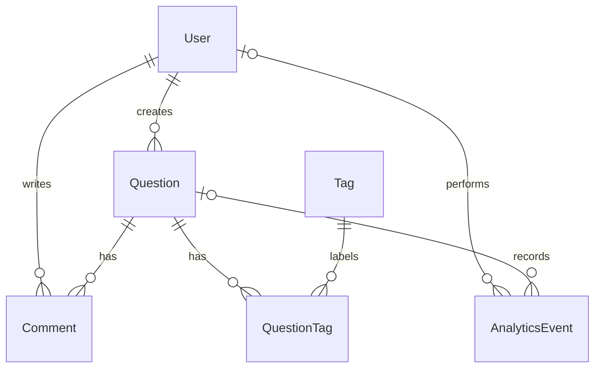

# STACK UNDERFLOW

A minimal Q&A platform where users can ask questions, add tags, browse existing
questions, search by keywords/tags, and leave answers/comments.

**Frontend:** Angular · **Backend:** Django REST Framework · **Database:** PostgreSQL

[Учебный отчёт на русском: MVP, диаграммы БД/CRUD, выполненные SQL и текущий поиск](docs/study/REPORT_RU.md)

```text
Angular → Django REST API → PostgreSQL
```

The existing user, question, tag and comment models are reused. Search matches
title, description and tag names. Suggestions wait 300 ms and show up to five
matches; a submitted search returns up to 50. This is keyword search without
embeddings. Analytics stores search, question_view and question_created events,
including an optional browser session UUID. Chat and profiles are outside the MVP.

## Structure and database

```text
backend/                  Django apps and stack_underflow settings
frontend/                 Existing Angular components and services
docs/                     TSIS 3, schema, analytics and deployment
docker-compose.yml        Backend + PostgreSQL; optional legacy services
```



[Real table names, keys and fields](docs/database_schema.md) ·
[PostgreSQL DDL](docs/database_schema.sql) · [TSIS 3 deliverables](docs/TSIS3_MVP.md)

## Local setup with PostgreSQL

Use Python 3.12, Node.js 18/npm and Docker Compose. From the repository root:

```bash
cp backend/.env.example backend/.env
python3 -c 'import secrets; print(secrets.token_urlsafe(48))'
```

Put the generated value in STACK_UNDERFLOW_SECRET_KEY and choose a private
DB_PASSWORD in backend/.env. Existing private .env files should be preserved;
compare them with the example instead of copying over them.

Main variables: STACK_UNDERFLOW_ENV_ID=local, DB_NAME, DB_USER, DB_PASSWORD,
DB_HOST=127.0.0.1, DB_PORT=5432, DB_SSLMODE=disable, ALLOWED_HOSTS and
CORS_ALLOWED_ORIGINS. Keep the example's local host/origin values for development.
The .env file is ignored by Git.

Start PostgreSQL:

```bash
docker compose --env-file backend/.env up -d db
```

Start Django:

```bash
python3 -m venv .venv
source .venv/bin/activate
pip install -r backend/requirements/base.txt
cd backend
python manage.py check
python manage.py migrate
python manage.py createsuperuser
python manage.py runserver
```

In a second terminal, from the repository root:

```bash
cd frontend
npm ci
npm start
```

Open http://localhost:4200. API docs: http://127.0.0.1:8000/api/docs/.
Admin: http://127.0.0.1:8000/admin/. There is no email-confirmation or worker
requirement for registration. Leave DB_HOST empty only if choosing the optional
SQLite developer fallback; deployed environments always use PostgreSQL.

Alternatively, run the backend in Docker (do not run another server on port 8000):

```bash
docker compose --env-file backend/.env up --build -d
docker compose --env-file backend/.env exec backend python manage.py migrate
docker compose --env-file backend/.env exec backend python manage.py createsuperuser
```

Compose sets DB_HOST=db inside the backend container. Start Angular using the
same npm commands. Existing Redis and Celery services are behind the legacy profile.

## Verify the MVP

With the virtual environment activated, from backend/:

```bash
python manage.py makemigrations --check --dry-run
python -m pytest tests/MVPTests.py tests/QuestionsTests.py tests/UsersTests.py tests/TagsTests.py tests/CommentsTests.py -q
```

The database user needs CREATEDB permission for Django's disposable test database
(the local Compose database user has it). These tests exclude the old Redis chat tests.

From frontend/:

```bash
npm run build
npm test -- --watch=false --browsers=ChromeHeadless --include=src/app/components/questions/questions.component.spec.ts --include=src/app/app.component.spec.ts
```

Chrome must be installed for browser tests. The production build fetches the
existing Google Font stylesheet and needs internet access.

Demo: register/login → ask a question with python/django tags → browse Questions
→ type a title word or tag → open a suggestion → add a comment → reload → inspect
AnalyticsEvent in admin.

Run SQL from the repository root:

```bash
docker compose --env-file backend/.env exec -T db sh -c 'psql -U "$POSTGRES_USER" -d "$POSTGRES_DB" -v ON_ERROR_STOP=1' < docs/analytics_queries.sql
```

[Analytics fields and counting rules](docs/analytics.md) ·
[SQL queries](docs/analytics_queries.sql)

## Deployment and API URL

All frontend API calls use environment.apiUrl, with an optional public runtime
value in assets/config.js. For a separate production API host, after building:

```bash
cd frontend
STACK_UNDERFLOW_API_URL=https://api.your-domain.example/api npm run configure:api
```

See [deployment.md](docs/deployment.md) for exact PostgreSQL, DEBUG=False,
allowed-host, CORS, HTTPS, static-site and backend settings. No public deployment
has been performed from this workspace; hosting credentials are still needed.
