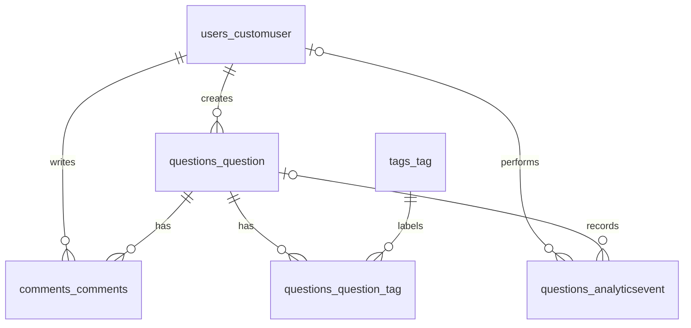

# TSIS 3 — STACK UNDERFLOW

## 1. MVP Scope

Users can register, log in, browse questions, search by words or tags, open a
suggestion, ask a question and leave comments. Tags are optional; a title and
description are required. Anyone can read; writing needs login.

Flow: open application → browse/search questions → open question → login/register
→ create question → add tags → submit question → leave a comment.

Chat, profiles, user management, password management, archives, background jobs
and analytics dashboards are outside this demo. Their old code can stay, but the
main flow needs only Angular, Django and PostgreSQL.

## 2. Database Structure

CustomUser stores accounts. Question stores the title, description, author and
date. Tag labels questions through questions_question_tag. Comments belong to a
question and author. AnalyticsEvent stores actions and optional user/question
references. We reused all existing entities.

See [table fields and keys](database_schema.md) and [PostgreSQL DDL](database_schema.sql).

## 3. Question Interface

- `/home`: simple landing page and links to browse or ask.
- `/questions`: question cards, Search button and suggestions while typing.
- `/questions/:slug`: description, tags, author/date and comments.
- `/newquestion`: title, description and tags; login required.
- `/questions/edit/:slug`: existing author edit form.
- `/tags` and `/tags/:slug`: browse tags and their questions.
- `/login` and `/signup`: existing account forms.

The navbar shows the brand, Questions, Tags, Ask Question and login/register or
logout. The form waits for tag creation to complete before posting a question.

## 4. Analytics Events

Django writes search, question_view and question_created events in PostgreSQL.
A browser UUID identifies the tab session; user_id is NULL for anonymous visitors.
There is no dashboard. See [event details](analytics.md) and
[the analysis queries](analytics_queries.sql).

## 5. Semantic Search

Our MVP uses lightweight matching on question title, description and tag names.
It uses Django Q objects, icontains and distinct. This is keyword matching, not
true semantic similarity. We avoid vector embeddings because the assignment
needs discovery and suggestions with the existing dataset. No AI API is used.

Suggestions wait 300 ms, cancel stale requests and show at most five questions.
Clicking one opens its detail page. Submitted searches show up to 50 matches.

## 6. STACK UNDERFLOW Branding

The project was rebranded from Uldar Net to STACK UNDERFLOW. The sports homepage
and announcement wording were replaced with a small programming Q&A interface.

## Run and demonstrate

Follow [README](../README.md) for local PostgreSQL and Angular commands. Create a
question tagged python, search for its title and then python, open a suggestion,
add a comment, reload and show the saved event records in Django admin. Run the
SQL queries to show daily counts, popular searches, tags and active sessions.
Public hosting instructions are in [deployment.md](deployment.md).

## Verification in this workspace

- All migrations applied on both the SQLite fallback and a fresh PostgreSQL 16 database.
- 82 API/MVP tests passed on PostgreSQL; six Angular branding/search tests passed.
- Production frontend build, production Django settings check and collectstatic passed.
- Browser flow passed using the production bundle and Daphne with PostgreSQL:
  registration/login, guarded create form, tags, comments after reload, debounced
  suggestions, suggestion click, title/description/tag search, no results and logout.
- All seven SQL statements ran on the PostgreSQL demo data.
- Docker Compose configuration validated. Docker itself was inaccessible to this
  workspace user, so verification used an isolated PostgreSQL instance instead.
- Existing frontend size/CSS warnings remain. Old Redis chat tests and the full
  legacy Angular test suite were not run. No public deployment was performed.
