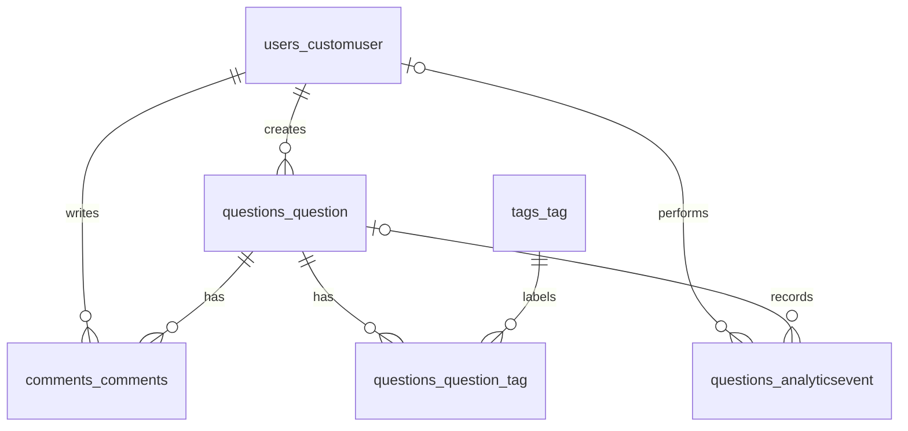

# Database schema

We reused the existing models and added AnalyticsEvent in the questions app.

| Table | What it stores |
| --- | --- |
| `users_customuser` | Registered users, email, hashed password and names. |
| `questions_question` | Title, description, author, slug, dates and existing active flag. |
| `tags_tag` | Tag names and slugs, for example python or django. |
| `questions_question_tag` | Existing many-to-many link between questions and tags. |
| `comments_comments` | Comment text, question, author and dates. The Python model is named Comments. |
| `questions_analyticsevent` | Event name, optional user/question/search query, and creation time. |

An event can belong to an anonymous visitor. Permanently deleting its user or question sets that event reference to NULL. The existing Question.delete() uses soft deletion (sets deleted_at), which keeps the event reference. Django also creates its usual admin, permission and session tables.
