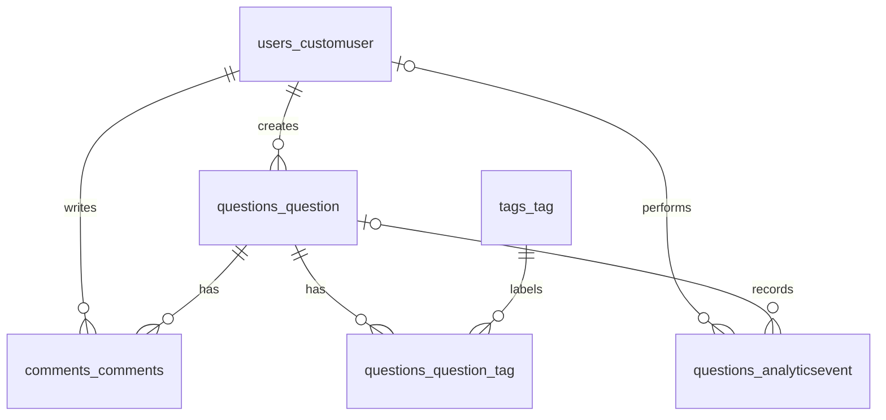

# MVP database

PostgreSQL stores all Q&A data and analytics. SQLite is only an optional local
fallback when DB_HOST is empty. We kept the original Django app/table names.
All six tables below use a generated bigint `id` primary key.

| Table | Important columns and constraints |
| --- | --- |
| `users_customuser` | Unique email varchar(254), password hash varchar(254), first_name/last_name varchar(50), is_active, is_staff, is_superuser, nullable last_login, avatar, created_at, updated_at and deleted_at. Existing preffered_language and timezone are retained. |
| `questions_question` | title varchar(255), nullable description text, unique slug varchar(50), author_id → users_customuser.id, is_active, created_at, updated_at, nullable deleted_at. The API requires title and description even though old rows may have no description. |
| `tags_tag` | name varchar(255), unique slug varchar(50), created_at, updated_at, nullable deleted_at. |
| `questions_question_tag` | question_id → questions_question.id, tag_id → tags_tag.id. The pair is unique. Django creates this table for the many-to-many tag field. |
| `comments_comments` | text (API limit 300 characters), question_id → questions_question.id, author_id → users_customuser.id, created_at, updated_at, nullable deleted_at. The Python model is named Comments. |
| `questions_analyticsevent` | event_name varchar(100), nullable user_id → users_customuser.id, nullable question_id → questions_question.id, nullable session_id varchar(64), nullable search_query varchar(255), nullable metadata JSONB, created_at. |

One user can create many questions and comments. A question can have many comments
and tags. One tag can belong to many questions. An analytics event may have no
user (anonymous) or no question (search).

Dates use PostgreSQL timestamps with time zone. Django creates foreign-key
indexes, unique indexes for email/slugs and a unique question/tag pair index.
[database_schema.sql](database_schema.sql) contains the actual PostgreSQL DDL for
these six tables, including indexes and constraints. It documents a fresh
migrated database; use Django migrations to install or update the application.

Existing instance deletion is soft deletion: deleted_at is set and the row stays.
Question list, search and detail hide deleted questions. For permanent ORM
deletion, questions cascade from their author, comments cascade from their
question and protect their author, and analytics user/question references become
NULL. These on_delete actions are implemented by Django; the SQL foreign keys
are deferred NO ACTION constraints, not database-level ON DELETE CASCADE.

Django also creates supporting auth_group, auth_permission, their linking tables,
users_customuser_groups, users_customuser_user_permissions, django_content_type,
django_admin_log, django_session and django_migrations. These are existing
framework tables, not extra MVP entities. The existing schema and migrations
remain intact; migration 0004 only adds session_id and metadata to AnalyticsEvent.
