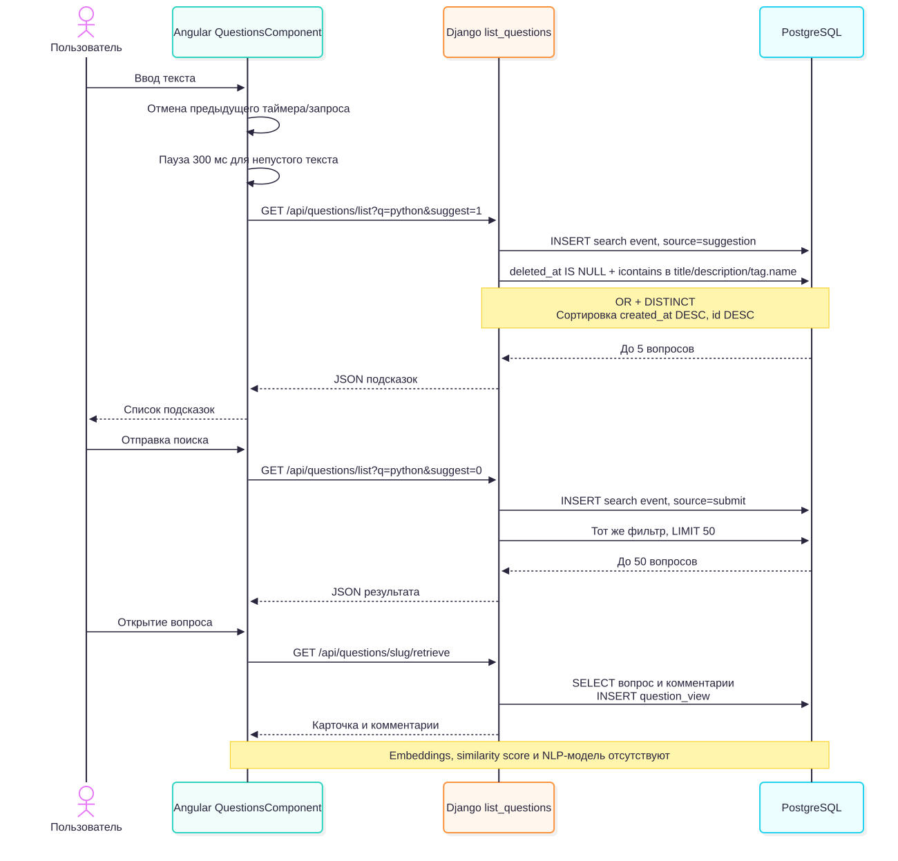

# STACK UNDERFLOW: MVP, база данных, CRUD и поиск

Учебный отчёт по текущему состоянию репозитория. Проверено локально 30 сентября 2026 года (Asia/Qyzylorda).

Основание: исходный код и миграции проекта, фактическое выполнение запросов и файл `StackOverFlow_TSIS1_2_Project_Description.docx`. В исходном документе проект называется **FlowOverStack**, в репозитории — **STACK UNDERFLOW**. Документ описывает идею и план семестра; реализованные возможности ниже определены по коду и проверке.

## 1. Краткое описание MVP: что есть и как работает

**STACK UNDERFLOW — веб-платформа вопросов и обсуждений для разработчиков и студентов.** Пользователь регистрируется, входит в аккаунт, публикует вопрос с заголовком, описанием и тегами. Другие пользователи находят вопрос через список, страницу тега или текстовый поиск и оставляют комментарии. Автор может отредактировать вопрос; удаление доступно через API.

Архитектура: **Angular → Django REST Framework → PostgreSQL**. Angular показывает формы и отправляет запросы. Django проверяет данные и права доступа, работает с таблицами через ORM и возвращает JSON. Вход использует JWT; при записи автор определяется сервером по авторизованному пользователю.

| Возможность | Текущее состояние |
| --- | --- |
| Регистрация и вход | Реализованы, выдаются access/refresh JWT |
| Список вопросов и карточка | Доступны без входа; карточка содержит вопрос и комментарии |
| Создание вопроса | Нужен вход; заголовок и описание обязательны, теги в API необязательны |
| Редактирование | Реализовано; сервер разрешает менять только свой вопрос |
| Удаление | API и метод Angular-сервиса есть; кнопки удаления в подключённом интерфейсе нет |
| Теги | Связь многие-ко-многим; форма умеет добавлять теги, есть страница вопросов по тегу |
| Комментарии | Можно добавить комментарий и изменить свой; отдельной сущности Answer нет |
| Поиск и подсказки | Поиск подстроки в заголовке, описании и тегах; подсказки после 300 мс |
| Аналитика | Сохраняются `question_created`, `question_view`, `search`; есть admin и SQL |
| Semantic search, дубликаты, рекомендации тегов | В документе запланированы; в текущем коде не реализованы |
| Аналитический dashboard и публичный deployment | В рамках этой проверки не подтверждены; готового dashboard в основном UI нет |

Сценарий демонстрации: **войти → Ask Question → заполнить вопрос и теги → открыть карточку → оставить комментарий → найти вопрос через поиск → Edit**. Старые модули чата и профилей не входят в подключённый основной маршрут MVP. Redis и Celery для этого сценария не требуются: по умолчанию используется `DummyCache`.

## 2. DataBase structure

В предметной области пять сущностей и одна промежуточная таблица. Реальные имена таблиц сохранены из Django. На диаграмме `PK` — первичный ключ, `FK` — внешний ключ, `UK` — уникальное поле; `o|` обозначает необязательную связь, `o{` — от нуля до многих записей.



Редактируемый исходник Mermaid: [database.mmd](database.mmd). Полный список столбцов с типами и ограничений из запущенной БД — запросы Q03 и Q04 в [sql_results.md](sql_results.md).

| Таблица | Назначение и ключевые ограничения |
| --- | --- |
| `users_customuser` | Аккаунт: уникальный `email`, хеш пароля, имя, фамилия, флаги доступа, язык и часовой пояс |
| `questions_question` | Вопрос: `title varchar(255)`, `description text`, уникальный `slug varchar(50)`, `author_id`, даты, `is_active` |
| `tags_tag` | Тег: `name varchar(255)`, уникальный `slug varchar(50)`; `name` сам по себе не UNIQUE |
| `questions_question_tag` | Связь вопроса и тега; пара `(question_id, tag_id)` уникальна |
| `comments_comments` | Текст комментария, обязательные `question_id` и `author_id`; ограничение 300 символов проверяет API |
| `questions_analyticsevent` | Имя события, необязательные пользователь/вопрос, `session_id`, `search_query`, `metadata jsonb`, время |

У всех шести таблиц `id bigint` с автоматической генерацией. Пользователь создаёт много вопросов и комментариев. У вопроса может быть много комментариев и тегов; один тег используется во многих вопросах. Поисковое событие может не иметь вопроса, а действие гостя — пользователя. Служебные таблицы Django (`auth_*`, `django_*`, связи прав пользователя) не показаны на предметной диаграмме.

**Удаление вопроса мягкое:** метод `AbstractBaseModel.delete()` заполняет `deleted_at`; строка, комментарии, теги и аналитика остаются. Список, поиск и карточка исключают вопросы с заполненным `deleted_at`. Флаг `is_active=False` сам по себе не скрывает вопрос в этих обработчиках.

В моделях есть правила `CASCADE`, `PROTECT`, `SET_NULL` для физического удаления через Django ORM. В PostgreSQL внешние ключи созданы как `DEFERRABLE INITIALLY DEFERRED`, без SQL `ON DELETE CASCADE`. Поэтому прямой SQL DELETE и мягкое удаление через API ведут себя по-разному. Для проверки удаления ниже используется именно API.

Нюанс схемы: `description` допускает NULL на уровне таблицы, но API **создания** требует непустое описание. Сериализатор обновления имеет другой набор правил. Таблица комментариев хранит `text`, а лимит длины 300 не является SQL CHECK. В поле `preffered_language` сохранено существующее написание из модели.

## 3. Процесс question interface CRUD

CRUD: **Create — создать; Read — прочитать; Update — изменить; Delete — удалить**.



Исходник Mermaid: [question_crud.mmd](question_crud.mmd). Удаление на диаграмме обозначено как операция API, потому что соответствующей кнопки в текущем UI нет.

| Операция | HTTP-запрос | Права и результат |
| --- | --- | --- |
| C | `POST /api/questions/create` | JWT; `201`, новый вопрос и событие `question_created` |
| R: список | `GET /api/questions/list` | Без входа; `200`, массив вопросов, в том числе пустой |
| R: карточка | `GET /api/questions/{slug}/retrieve` | Без входа; `200`, вопрос + комментарии, событие `question_view` |
| U | `PATCH /api/questions/{slug}/update` | JWT и авторство; `200`, сохранённые поля |
| D | `DELETE /api/questions/{slug}/destroy` | JWT и авторство; `204`, заполнен `deleted_at` |

При создании форма сначала находит или создаёт теги, затем передаёт их ID вместе с вопросом. Сервер проверяет сериализатор, генерирует уникальный slug, сохраняет вопрос и связи тегов. Автор берётся из `request.user`, а не из переданного клиентом `author`. После ответа форма открывает карточку.

При редактировании загружаются вопрос и теги. Автор отправляет PATCH, сервер проверяет авторство и сохраняет изменения. **При передаче `title` пересчитывается slug**, поэтому прежний адрес может перестать работать; Angular после сохранения возвращает пользователя к списку. Обновление только описания адрес не меняет.

Ошибки: `401` — отсутствует действующая авторизация; `403` — пользователь не автор; `400` — некорректные данные; `404` — вопрос не существует или мягко удалён. Скрытая кнопка Edit сама по себе не защищает данные: права повторно проверяются сервером. Обработчики записи также сбрасывают соответствующие ключи кэша; в стандартной локальной конфигурации кэш отключён.

## 4. SQL для проверки таблиц: примеры и реальные результаты

Создана отдельная локальная БД **`stack_underflow_study`**, PostgreSQL **16.15**, адрес **127.0.0.1:55432**, пользователь **study**. Это учебные данные. Учётные записи и теги подготовлены через ORM; вопросы, комментарии, мягкое удаление и события созданы вызовами настоящих обработчиков API. Внешний HTTP-сервер и браузер для этой проверки не запускались.

Все **15 SQL-запросов реально выполнены** через Django cursor в транзакции `READ ONLY`. Файлы:

- [check_tables.sql](check_tables.sql) — готовые запросы Q01–Q15.
- [sql_results.md](sql_results.md) — полный текст каждого запроса и фактические таблицы результата.
- [verification.json](verification.json) — те же результаты в машиночитаемом виде, время запуска и проверки API.
- [psql_results.txt](psql_results.txt) — сохранённый вывод повторного выполнения всех запросов непосредственно в `psql`.
- [backend_tests.txt](backend_tests.txt) — результат существующих тестов проекта.

| Проверяемая таблица | Реальное количество строк |
| --- | --- |
| `users_customuser` | 2 |
| `questions_question` | 4: три видимых и один мягко удалённый |
| `tags_tag` | 4 |
| `questions_question_tag` | 6 |
| `comments_comments` | 3 |
| `questions_analyticsevent` | 12 |

**Пример 1 — видимые вопросы с авторами и тегами (Q07):**

```sql
SELECT q.id, q.title, u.email AS author,
       COALESCE(string_agg(t.name, ', ' ORDER BY t.name), '(no tags)') AS tags
FROM questions_question q
JOIN users_customuser u ON u.id = q.author_id
LEFT JOIN questions_question_tag qt ON qt.question_id = q.id
LEFT JOIN tags_tag t ON t.id = qt.tag_id
WHERE q.deleted_at IS NULL
GROUP BY q.id, q.title, u.email
ORDER BY q.id;
```

Результат:

| id | title | author | tags |
| --- | --- | --- | --- |
| 1 | Django serializers explained | alice@example.com | django, python |
| 2 | PostgreSQL unique constraint | alice@example.com | postgresql, python |
| 3 | Angular component communication | alice@example.com | angular |

**Пример 2 — сколько комментариев у каждого вопроса (Q09):**

```sql
SELECT q.id, q.title, COUNT(c.id) AS comment_count
FROM questions_question q
LEFT JOIN comments_comments c
  ON c.question_id = q.id AND c.deleted_at IS NULL
WHERE q.deleted_at IS NULL
GROUP BY q.id, q.title
ORDER BY q.id;
```

Результат: Django — **2**, PostgreSQL — **1**, Angular — **0**. `LEFT JOIN` сохраняет в результате вопрос без комментариев, а `COUNT(c.id)` даёт для него ноль. Количество тегов здесь не умножает число комментариев: промежуточная таблица тегов не присоединяется.

**Пример 3 — что записывает аналитика (Q13):**

```sql
SELECT event_name, COALESCE(metadata->>'source', '-') AS source,
       COUNT(*) AS events
FROM questions_analyticsevent
GROUP BY event_name, metadata->>'source'
ORDER BY event_name, source;
```

| event_name | source | events |
| --- | --- | --- |
| question_created | - | 4 |
| question_view | - | 3 |
| search | submit | 4 |
| search | suggestion | 1 |

Остальные запросы показывают текущую БД и версию сервера, существующие таблицы, типы столбцов, ключи, аккаунты без паролей, тексты комментариев, популярность тегов, сохранённую удалённую строку, поиск `python` и поисковые фразы. Q15 проверяет потерянные связи и повторяющиеся пары вопрос–тег: **все восемь проверок вернули 0 проблем**.

### Как повторить на этом компьютере

Включить Docker Desktop. Открыть PowerShell в корне репозитория и выполнить:

```powershell
powershell -NoProfile -ExecutionPolicy Bypass -File .\docs\study\run-demo.ps1 -RunTests
```

Скрипт подготавливает `.venv`, устанавливает зависимости для проверки, запускает отдельную PostgreSQL, применяет реальные миграции проекта и сохраняет результаты. При повторном запуске готовые учебные записи сохраняются. Временные записи CRUD-проверки откатываются транзакцией. Существующие backend-тесты используют отдельную тестовую БД, которую Django создаёт и удаляет самостоятельно.

Пароль БД и локальный Django secret автоматически созданы в `.env.study`; файл исключён из Git. `backend/.env` для этого сценария не нужен. Внешний доступ к порту БД не опубликован: используется только localhost. После перезагрузки для повторения достаточно этой же команды при работающем Docker.

Можно выполнить SQL напрямую через установленный в контейнере `psql`, без Python:

```powershell
Get-Content -Raw -Encoding UTF8 .\docs\study\check_tables.sql |
  docker compose --env-file .env.study -f docs/study/compose.yml exec -T db psql -X -U study -d stack_underflow_study -v ON_ERROR_STOP=1 -P pager=off
```

Остановка учебной БД с сохранением данных:

```powershell
docker compose --env-file .env.study -f docs/study/compose.yml stop
```

Результаты проверки: **15/15 SQL-запросов, 15/15 проверок API, 82/82 backend-теста**. `manage.py check` не нашёл проблем, `makemigrations --check --dry-run` не нашёл новых изменений. Тесты сообщили предупреждения об отсутствующей папке `backend/staticfiles`; на результат API и SQL они не повлияли. Интерфейс Angular изучен по исходникам; визуальная проверка приложения и его сборка не входят в эти результаты.

## 5. Как сейчас работает semantic search

**Semantic search в текущей версии ещё не реализован.** Сейчас работает поиск по текстовым совпадениям. В исходном DOCX семантический поиск через embeddings описан как запланированный вклад NLP-инженера и функция приоритета Should. Автодополнение на странице Questions использует тот же текстовый фильтр.



Исходник Mermaid: [search.mmd](search.mmd).

Текущий алгоритм:

1. Angular получает ввод, отменяет предыдущий таймер/запрос и для непустого текста ждёт **300 мс**. После этого запрашивает подсказки с `suggest=1`.
2. Backend убирает пробелы по краям `q`. Для непустой строки ищет её **как целую подстроку** в `title`, `description` или `tag.name`, без учёта регистра (`icontains`, условия OR).
3. Отбираются вопросы с `deleted_at IS NULL`. `distinct()` убирает повтор вопроса, если совпало несколько тегов.
4. Сортировка — **сначала новые**: `created_at DESC, id DESC`. Оценки смысловой релевантности нет.
5. Подсказки ограничены **5**, отправленный поиск — **50** вопросами. Пустой запрос возвращает обычный список без этого ограничения и без события `search`.
6. Для каждого непустого поискового запроса создаётся `search`, где `metadata.source` равен `suggestion` или `submit`. Открытие карточки создаёт `question_view`.

Фильтр из текущего backend:

```python
Question.objects.filter(deleted_at__isnull=True).filter(
    Q(title__icontains=query)
    | Q(description__icontains=query)
    | Q(tag__name__icontains=query)
).distinct()
```

Подтверждённые примеры на учебных данных из [search_examples.json](search_examples.json):

| Запрос | Найдено | Почему |
| --- | --- | --- |
| `python` | 2 | Совпадение с тегом у Django и PostgreSQL; удалённый Python-вопрос скрыт |
| `DJANGO` | 1 | Совпадение без учёта регистра |
| `parameterized queries` | 1 | Целая фраза есть в описании PostgreSQL-вопроса |
| `avoid duplicate rows` | 0 | Фразы нет в тексте и тегах, хотя вопрос про UNIQUE связан с этой задачей по смыслу |
| `python`, подсказки | 2 | Тот же фильтр с лимитом 5; на этих данных совпадений только два |

Здесь нет модели embeddings, векторных столбцов/индекса, вычисления cosine similarity, обработки синонимов или ранжирования по смыслу. Пробелы внутри запроса не разбивают его на отдельные ключевые слова. Результаты зависят от буквального текста и тегов.

Для будущего semantic search потребуется отдельная реализация: **текст вопроса → embedding → хранение векторов; запрос → embedding той же модели → поиск ближайших векторов → список по близости**. После создания и редактирования вопроса нужно обновлять его вектор; удалённые вопросы нужно исключать. Это описание следующего этапа, а не работающей функции.

Аналитика сейчас тоже ограничена: `question_view` означает успешное получение карточки, включая повторные открытия; это не отдельное событие клика из поиска. В `search` не сохраняются количество результатов, их ID или similarity score. Поэтому долю пустых результатов и точный CTR поиска нельзя достоверно восстановить только из существующих событий. Сессия `X-Session-ID` помогает связать действия, но не доказывает, что конкретный просмотр был результатом конкретного поиска.

### Короткий текст для защиты

«Наш MVP — платформа технических вопросов с регистрацией, тегами и комментариями. Angular обращается к Django REST API, данные хранятся в PostgreSQL. Для вопросов реализован CRUD с проверкой авторства; удаление мягкое и пока вызывается через API. Мы проверили структуру базы и выполнили 15 SQL-запросов с сохранёнными результатами. Сейчас поиск работает по подстрокам в заголовке, описании и тегах. Семантический поиск с embeddings, выявление дубликатов и рекомендации тегов относятся к следующему этапу проекта».

### Где это находится в коде

- [Модели вопросов и аналитики](../../backend/apps/questions/models.py), [пользователя](../../backend/apps/users/models.py), [тега](../../backend/apps/tags/models.py), [комментария](../../backend/apps/comments/models.py).
- [CRUD, поиск и события](../../backend/apps/questions/views.py), [сериализаторы и изменение slug](../../backend/apps/questions/serializers.py), [мягкое удаление](../../backend/apps/abstract/models.py).
- [Поиск в Angular](../../frontend/src/app/components/questions/questions.component.ts), [API-сервис](../../frontend/src/app/services/questions.service.ts), [карточка и кнопка Edit](../../frontend/src/app/components/question-detail/question-detail.component.html).
- [Заголовки JWT и сессии](../../frontend/src/app/AuthInterceptor.ts), [подключённые маршруты UI](../../frontend/src/app/app-routing.module.ts).
